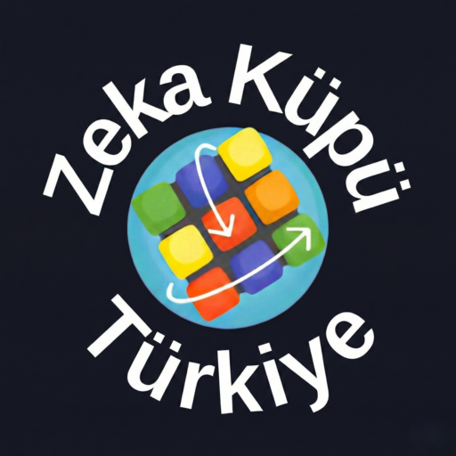
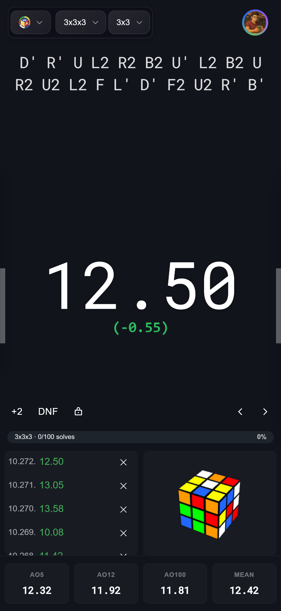
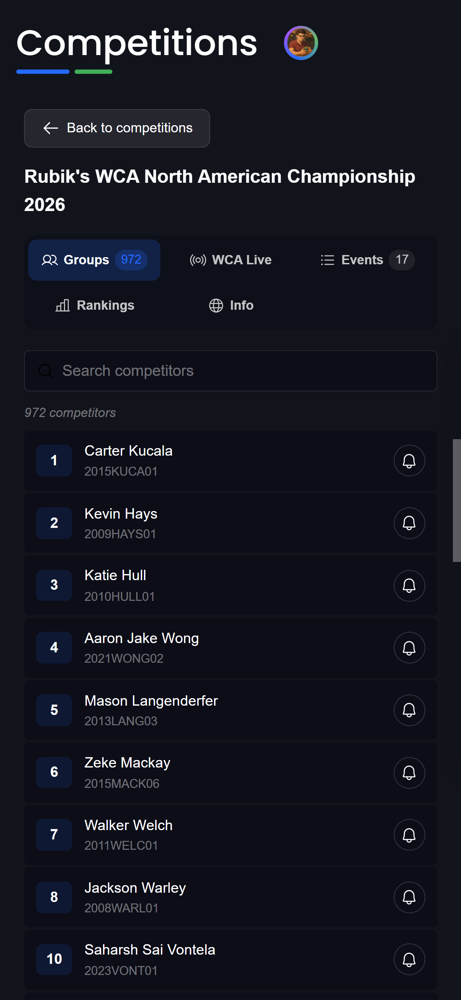
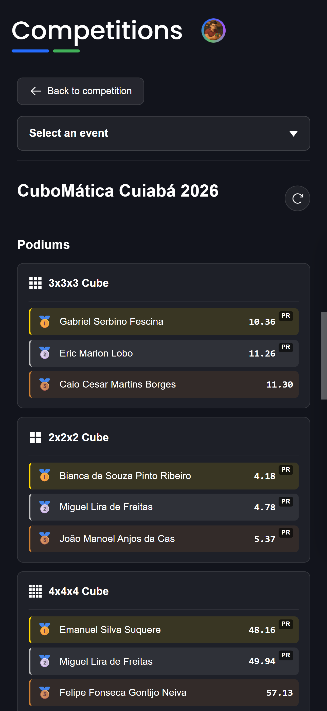
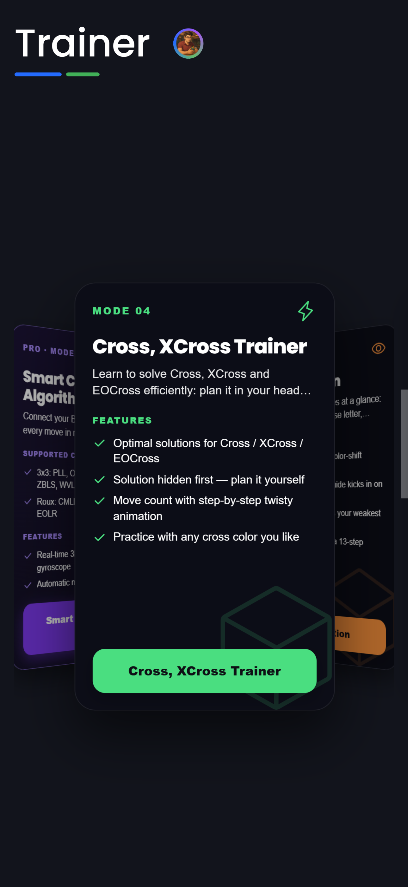
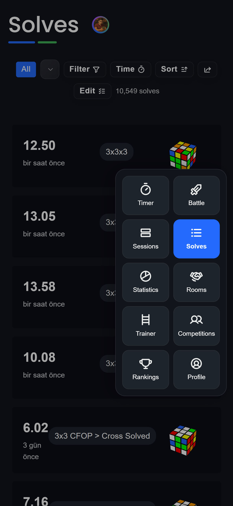
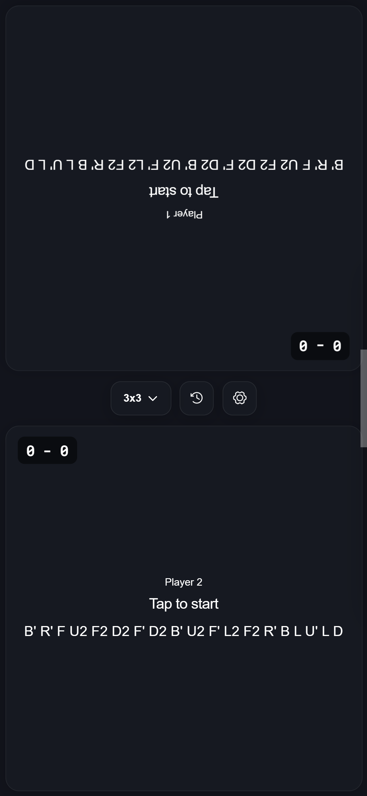
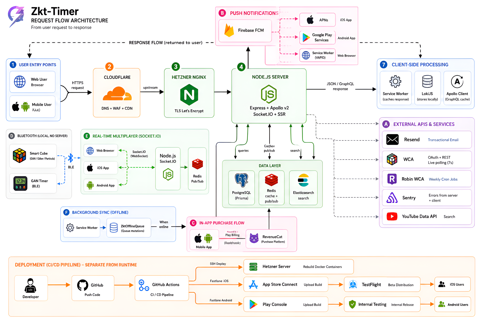

<div align="center">

<picture>
  <source media="(prefers-color-scheme: dark)" srcset="public/images/zkt-logo-white.png">
  
</picture>

### A complete speedcubing ecosystem, all in one place

A precision timer, Bluetooth smart-cube support, an algorithm trainer, puzzle solvers, real-time multiplayer,
and a full competition platform. On the web and on native mobile.

Timer · Smart Cube · Algorithm Trainer · Puzzle Solvers · Rooms · WCA Competitions

[](https://zktimer.app)
[](https://apps.apple.com/app/zkt-timer/id6760920873)
[](https://play.google.com/store/apps/details?id=com.zktimer.app)
[](LICENSE)

</div>

---

## Overview

Zkt Timer is a full-stack speedcubing platform I made for the WCA cubing community. It brings everything a
cuber needs into a single product: a precision timer with Bluetooth smart-cube support, an algorithm trainer,
a full suite of puzzle solvers, real-time multiplayer rooms, and a complete unofficial competition system. It
runs as a server-side rendered web app and as native iOS and Android apps, and it speaks five languages.

My goal is simple: instead of juggling a timer here, a trainer there, and a separate site for competitions,
everything lives under one roof, with your solves, sessions, and progress synced across every device.

## Screenshots

<div align="center">
<table>
  <tr>
    <td></td>
    <td></td>
    <td></td>
  </tr>
  <tr>
    <td></td>
    <td></td>
    <td></td>
  </tr>
</table>
</div>

## Features

### Timer & Input
A precision timer built for serious practice. Time with the keyboard, the touchscreen, or manual entry, with
full WCA inspection (the 15-second countdown, audio cues, haptic feedback, and +2 / DNF penalties). Plug in a
StackMat, GAN Timer, or QiYi Timer for hardware-accurate timing, or use the native "drop to stop" gesture on
mobile to end a solve by setting the phone down.

### Smart Cubes (Bluetooth)
Connect Bluetooth smart cubes over BLE and watch every turn happen in real time. It supports the GAN, Giiker,
Particula, MoYu, and QiYi cube protocols (ported from cstimer), with a live 3D cube visualization, gyroscope
orientation, MAC discovery, full move replay, and per-case statistics for OLL and PLL.

### Algorithm Trainer
Drill OLL, PLL, F2L, ZBLL, and many more algorithm sets, each with its own statistics, smart queue ordering,
and 2D and 3D pattern visualization. I included a dedicated PLL recognition trainer, an efficiency trainer for
cross, xcross, and eocross, smart-cube integration for hands-on drilling, and PDF export so you can print your
algorithm sheets.

### Puzzle Solvers
A full suite of step solvers running in Web Workers: Cross, XCross, EOLine, EOCross, Roux first block, Petrus,
ZZ, EODR, 2x2, Pyraminx, Skewb, and Square-1. Generate efficient solutions and study them move by move.

### Statistics & Sessions
Organize your solves into sessions, follow rolling averages and personal bests, and dig into a detailed
statistics page alongside customizable timer modules. Set per-cube-type daily goals with progress tracking and
an activity heatmap, and keep everything synced across devices with full offline support.

### Community & Competition
Run unofficial WCA-style competitions from start to finish: registration, scorecard entry, live results, staff
assignment for judges, scramblers, and runners, national record tracking, and delegate management. Log in with
WCA OAuth to bring in your profile, records, and competition history, browse official WCA competitions with
their WCIF data, groups, events, rankings, and live results, play real-time multiplayer rooms with chat and
shared scrambles, challenge a friend in 1v1 battle mode, climb the leaderboards, and share a generated Cuber
Card of your profile.

### Platform
Server-side rendered on the web for fast first loads and strong SEO, and shipped as native iOS and Android
apps through Capacitor. It is fully localized in five languages (Turkish, English, Spanish, Russian, Chinese),
with a three-tier membership model (Free, Pro, Premium), push notifications, and offline-first behavior
throughout.

## Architecture

The request flow from a user action all the way to the response: web and mobile entry points, Cloudflare,
Nginx, the Node.js server (Express + Apollo v2 + Socket.IO + SSR), the PostgreSQL, Redis, and Elasticsearch
data layer, and the external services it talks to.

<div align="center">
  
</div>

**Stack:** React 17 · custom esbuild SSR · type-graphql + Apollo Server · Prisma + PostgreSQL · Redis ·
Socket.IO · Elasticsearch · Capacitor 6 · TypeScript

## Local Development

> Requires Node 20.x and Yarn.

```bash
yarn install
yarn graphql-codegen   # generate GraphQL types (run before building)
yarn dev               # client build + server
```

The full stack (PostgreSQL, Redis, app server) runs with `docker compose up`.

## Credits & Gratitude

I built Zkt Timer by gathering inspiration from many different open-source projects and bringing them together
under a single roof. Along the way, I solved some problems in my own way, adapted ideas where they fit, and
rewrote others from scratch. But whatever the path, this project would not exist without the work that came
before it.

I offer my deepest gratitude and endless thanks to the authors and developers of every project that inspired
or guided me. Full attribution for each one is on my **[Credits page](https://zktimer.app/credits)**.

## License

[GNU General Public License v3.0](LICENSE)
